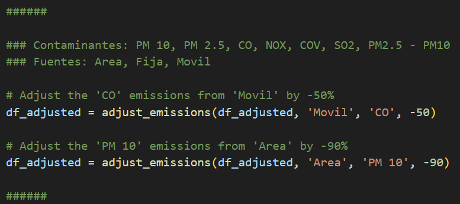

Para ajustar los valores se utiliza la función `adjust_emissions()`
Ej. `df = adjust_emissions(df, 'Movil', 'CO', -50)`
En donde:
- df es el DataFrame de la tabla de datos
- 'Movil' es la fuente
- 'CO' es el contaminante
- -50 es el cambio en porcentaje

El archivo de Excel debe de estar en la misma carpeta que el programa `main.py`